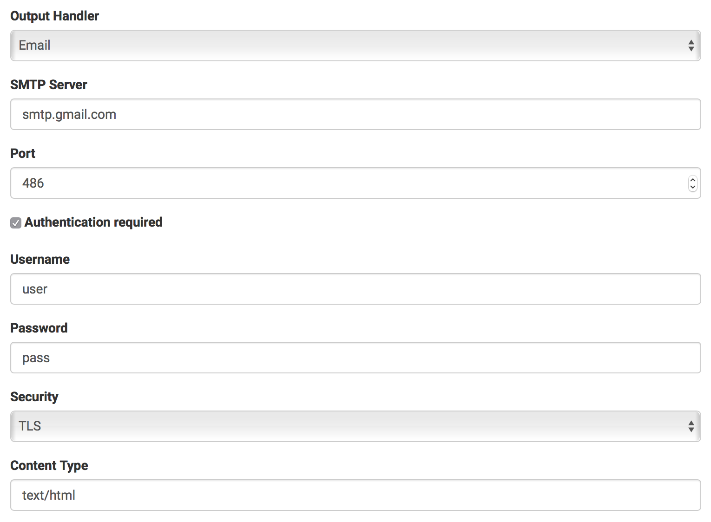

# Understanding Output Handling
Templates are bound to one or more Channels, which in turn are defined on top of a specific Output Handler. When you send a message using the Send API, an instance of the defined Output Handler is created and initialized with the Channel's configuration for this Output Handler by the Send Queue Scheduler. As a technical component, Output Handlers focus on doing the actual work of sending a message. Sending can either succeed or fail, where a failure can be temporary (e.g. because the destination host is not reachable) or permanent (e.g. because the destination does not accept the incoming message for some reason). An Output Handler returns the outcome of the attempt to send the message. The Send Queue Scheduler cares for re-scheduling a message if necessary, logging, archiving, etc.

Tubewarder features several built-in Output Handlers, for example one for sending messages via Email using an SMTP server or by calling a HTTP URL. There is an API that can be used for developing custom Output Handlers.

# Writing a custom Output Handler
Output Handlers are developed in Java. They are POJOs (Plain Old Java Objects).


## Maven dependency
If you're using Maven, add the following dependency to your pom.xml:

```
<dependency>
    <groupId>net.weweave.tubewarder</groupId>
    <artifactId>outputhandler-api</artifactId>
    <version>1.0.0</version>
</dependency>
```

Check the central Maven Repository for the latest version:

http://mvnrepository.com/artifact/net.weweave.tubewarder/outputhandler-api


## Skeleton Code
Let's take a look at the Null Output Handler:

```
package net.weweave.tubewarder.outputhandler;

import net.weweave.tubewarder.outputhandler.api.*;
import net.weweave.tubewarder.outputhandler.api.configoption.OutputHandlerConfigOption;

import java.util.ArrayList;
import java.util.List;

@OutputHandler(id="NULL", name="Null (no action)")
public class NullOutputHandler implements IOutputHandler {
    @Override
    public void process(Config config, Address sender, Address recipient, String subject, String content, List<Attachment> attachments)
                throws TemporaryProcessingException, PermanentProcessingException {
        // TODO
    }

    @Override
    public List<OutputHandlerConfigOption> getConfigOptions() {
        return new ArrayList<>();
    }

    @Override
    public void checkConfig(Config config) throws InvalidConfigException {
        // TODO
    }

    @Override
    public void checkRecipientAddress(Address address) throws InvalidAddessException {
        // TODO
    }
}
```

Your Output Handler must implement the IOutputHandler interface with its four methods:

* ```getConfigOptions()```: Returns a list of valid configuration options. These are shown in the web interface when configuring a Channel with your custom Output Handler. The concrete config options are provided to the ```checkConfig()``` and ```process()``` methods.
* ```checkConfig()```: Checks the supplied Channel configuration. If the configuration is invalid, an InvalidConfigException must be thrown.
* ```checkRecipientAddress()```: Checks the supplied recipient address. If the address is invalid, an InvalidAddessException must be thrown.
* ```process()```: Sends the message to the specified recipient.

Additionally, the annotation ```@OutputHandler``` is required to specify a unique ID and a readable name for your Output Handler.


## Config Options
Here's the ```getConfigOptions()``` implementation of the Email Output Handler:

```
@Override
public List<OutputHandlerConfigOption> getConfigOptions() {
    List<OutputHandlerConfigOption> options = new ArrayList<>();
    options.add(new StringConfigOption("smtpServer", "SMTP Server", true, ""));
    options.add(new IntConfigOption("port", "Port", true, 25));
    options.add(new BoolConfigOption("auth", "Authentication required", false, false));
    options.add(new StringConfigOption("username", "Username", false, ""));
    options.add(new StringConfigOption("password", "Password", false, ""));
    SelectConfigOption security = new SelectConfigOption("security", "Security", true, "NONE");
    security.addOption("NONE", "None");
    security.addOption("SSL", "SSL");
    security.addOption("TLS", "TLS");
    options.add(security);
    options.add(new StringConfigOption("contentType", "Content Type", true, "text/plain"));
    return options;
}
```

In the web interface, this looks like the following:



This is a part of the ```checkConfig()``` implementation of the Email Output Handler:

```
@Override
public void checkConfig(Config config) throws InvalidConfigException {
    if (GenericValidator.isBlankOrNull(config.getString("smtpServer"))) {
        throw new InvalidConfigException("SMTP server must not be empty");
    }
    ...
}
```

## Logging
Logging should be accomplished using ```java.util.logging.Logger``` like this:

```
private static final Logger LOG = Logger.getLogger(EmailOutputHandler.class.getName());
...
LOG.fine("Checking recipient address: " + address.getAddress());
```

## Javadoc
Refer to the Output Handler API Javadoc for detailled information about the different classes and methods.

# Deploying an Output Handler
Output Handlers are packaged as JAR files. These should include all required dependencies as well. The JAR files are placed in Tubewarder's ```libs/``` directory and loaded at server start automatically. You can check if your Output Handler is being loaded by checking the server log file (console or ```/var/log/tubewarder.log``` in Docker container).

If you're using the Docker container, you should create a child image of weweave/tubewarder and add your custom Output Handler like this:

```
FROM weweave/tubewarder
ADD myhandler.jar /opt/tubewarder/lib/
```
