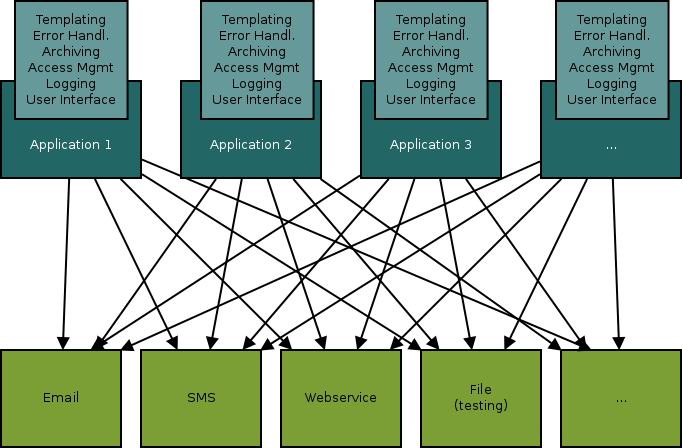
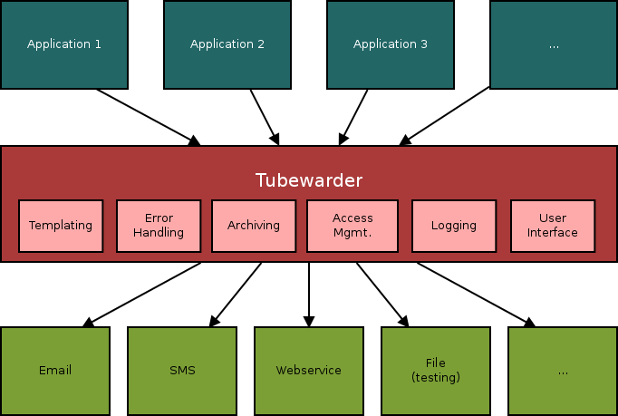
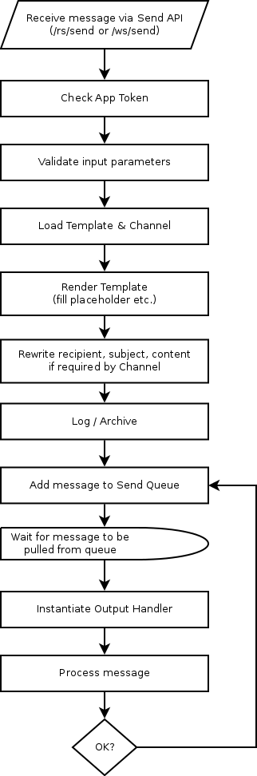

# Overview
Traditional infrastructures usually look similar to the following diagram: All of your applications have an n:m relationship with all of your outbound messaging services. Besides the vast connectivities, you have lots of duplicated code for logging, archiving, templating, error handling, etc. 

Introducing Tubewarder as the central system for handling your outgoing messages, all your applications talk to Tubewarder (1:n), while Tubewarder keeps in touch with the outbound service (1:n). All the code for logging, monitoring, error handling, archiving, etc. is in one place. An easy-to-use web interface allows for managing your message templates for the various channels in one central place. 

Tubewarder is easy to deploy, has low overhead, and is a good idea if you have as few as two applications doing outbound messaging.

# Features
* Connect applications to Tubewarder using SOAP web services or RESTful services
* Easy-to-use templating system based on [Handlebars](http://handlebarsjs.com/)
* Built-in outbound connectors: Email, HTTP(S)
* Configurable, extendable outbound connectors (API available)
* Error handling for outgoing messages
* Asynchronous processing
* Send Queue Scheduler with configurable max. concurrent threads and retry count
* Archiving of outbound messages for legal purposes
* Powerful administrative web interface
* Integrated user and access management for the web interface 

# Architecture
Tubewarder employs a loose coupling of Output Handlers, Channels and Templates:

**An Output Handler** is a generic technical component that consumes a message to be sent and does something with it. For example, there is a built-in Output Handler for sending a message to an Email Servers, or for sending a message to an HTTP(S) URL.

**A Channel** is a specific route to send an outbound message by using a specific configuration of an Output Handler. For example, you can have a Channel for sending HTML Mails via your company's SMTP Server reachable at a specific TCP/IP address and port and by establishing a TLS connection, or you can have a Channel for sending text messages (SMS) via some RESTful web service reachable via HTTP POST at a specific URL.

**A Template** is a concrete message you want to send. A Template can contain variables and control structures (e.g. placeholders for salutation, name, and personalized URLs). A Template can be bound to one or more Channels, each with different texts as desired. So, you could have a Template called "New User Welcome Message", with different contents for saying Welcome to your new user via Plain Text Email, HTML Email, or SMS.

Several Output Handlers are shipped with the default installation of Tubewarder. As technical components, they are programmed. Java programmers can easily write their own custom Output Handlers using Tubewarder's Output Handler API.

Channels are usually defined by a system administrator who knows the technical infrastructure. Channels can be defined and configured using Tubewarder's Web Interface. No programming is necessary for this.

Templates are usually defined by application developers or the department staff. They can be defined using Tubewarder's Web Interface as well.

When an application sends a message via Tubewarder, it connects to Tubewarder's **Send API** using SOAP or REST (both HTTP/S). To avoid anyone knowing the URL of your Tubewarder installation's Send API being able to send messages, each applications needs an **App Token**. App Tokens are authorization keys allowing applications to use Tubewarder's Send API. They can be defined using Tubewarder's Web Interface. This is usually done by system administrators or authorization management staff.

The process of processing a message is as follows:

